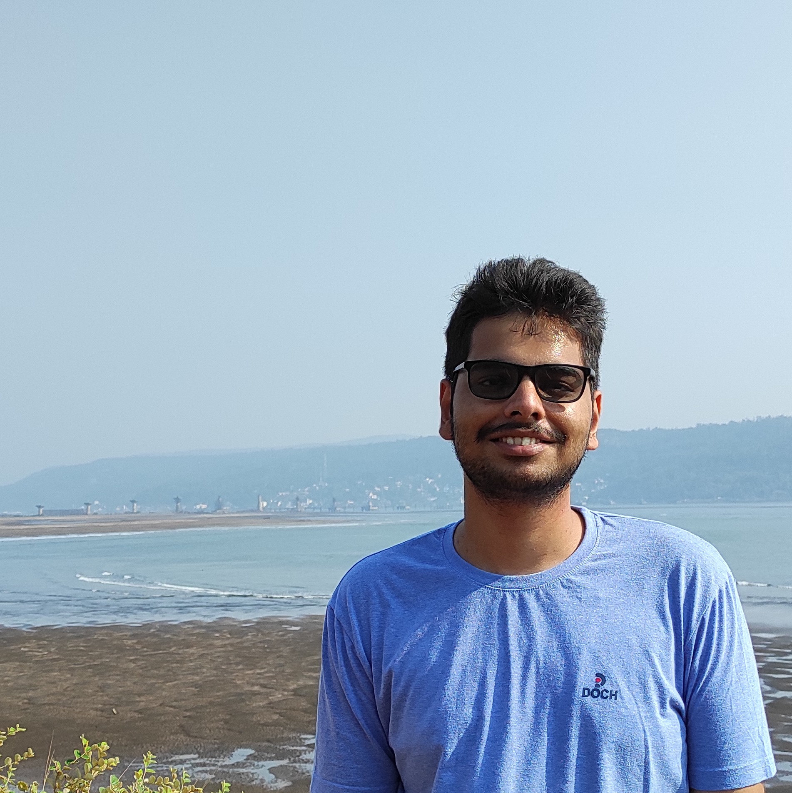

\
\
Hi, I'm Abhijeet (अभिजीत प्रसाद बोडस), a second year undergraduate student at
Indian Institute of Technology Bombay, majoring in [Mechanical Engineering](https://www.me.iitb.ac.in/).

I have a keen interest in software development and open source, and am currently
exploring machine learning and related areas. Checkout my
[GitHub profile](https://github.com/abhijeetbodas2001), where I put most of my work.

I go by `abhijeetbodas2001` (or `abhijeetpbodas`) on most online platforms. You can find
links to my social media accounts in the sidebar. Feel free to reach out!
