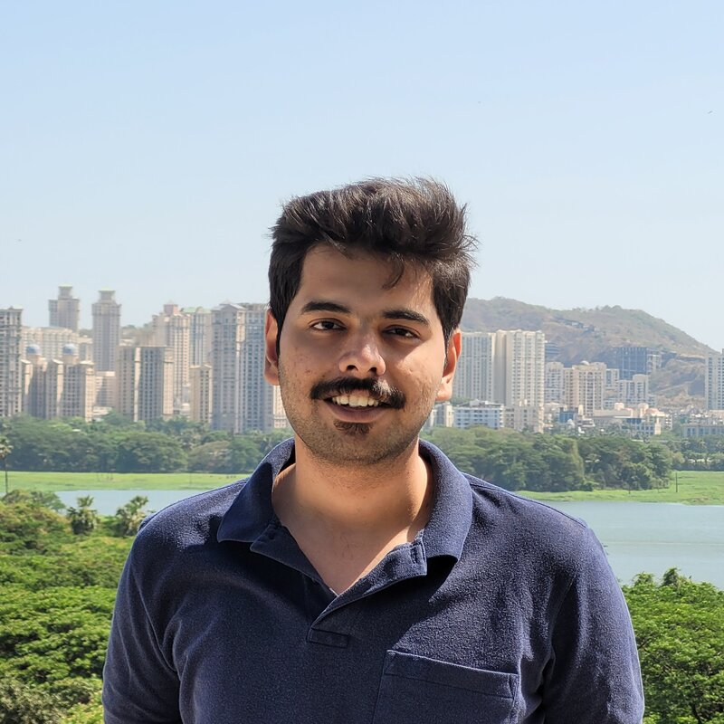

Hi, I’m Abhijeet (अभिजित प्रसाद बोडस), a fourth year undergraduate student at
the Indian Institute of Technology Bombay. I'm pursuing a major in the
Mechanical Engineering department and have completed a minor degree in Computer
Science.

    <a href="https://github.com/abhijeetbodas2001/resume/raw/master/latest/one_page.pdf">Résumé</a>&nbsp;&#124;
    <a href="/academics">Academics</a>&nbsp;&#124;
    <a href="/articles">Articles</a>&nbsp;&#124;
    <a href="/contact">Contact</a>&nbsp;&#124;
    <a href="/about">About</a>

